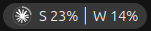
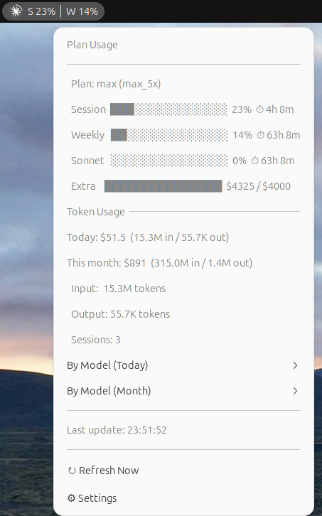
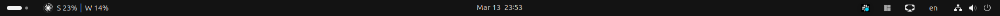

# Claude Monitor

A GNOME Shell extension that shows your [Claude Code](https://docs.anthropic.com/en/docs/claude-code) usage in the top bar — rate limits, token costs, and session stats at a glance.


### Top Bar


### Dropdown Menu


### Full Screen


## Quick Start

```bash
git clone https://github.com/henrytsui000/claude-topbar-monitor.git
cd claude-topbar-monitor
make install
```

Then restart GNOME Shell:

| Session | How to restart |
|---------|---------------|
| **X11** | `Alt+F2` → type `r` → `Enter` |
| **Wayland** | Log out and log back in |

Finally, enable:

```bash
gnome-extensions enable claude-monitor@henrytsui.dev
```

> **That's it!** No API keys or configuration needed — it reads your Claude Code credentials automatically.

## Features

- **Top bar indicator** with Claude logo icon + session/weekly usage percentages
- **Clock arc overlay** on icon — fills based on 5-hour session usage, changes color at 50%/80%
- **Real-time rate limits** from Claude's usage API:
  - 5-hour session utilization with reset timer
  - 7-day weekly utilization with reset timer
  - Per-model breakdown (Sonnet, Opus)
  - Extra usage tracking (credits used / limit)
  - Progress bars with color coding
- **Local token usage** from Claude Code session logs:
  - Today's and monthly cost estimates
  - Input / output token counts
  - Per-model cost breakdown
  - Session count
- **Configurable display** — show Session (S), Weekly (W), or both in panel
- **Panel position** — place on left or right side of the top bar
- **Zero configuration** — reads OAuth token and session logs from `~/.claude/` automatically

## How It Works

**Rate limits**: Reads your OAuth token from `~/.claude/.credentials.json` and fetches utilization data from Anthropic's usage API (same data as `/usage` in Claude Code).

**Token costs**: Scans Claude Code session logs (`.jsonl` files in `~/.claude/projects/`) and calculates costs using published per-token pricing.

## Settings

```bash
gnome-extensions prefs claude-monitor@henrytsui.dev
```

| Setting | Default | Description |
|---------|---------|-------------|
| Refresh Interval | 60s | How often to fetch usage data |
| Display Mode | Cost | Show cost, token count, or both |
| Session (S) | On | Show 5-hour usage in panel |
| Weekly (W) | On | Show 7-day usage in panel |
| Panel Position | Left | Place indicator on left or right |

## Uninstall

```bash
make uninstall
```

## Requirements

- GNOME Shell 45, 46, 47, or 48
- [Claude Code](https://docs.anthropic.com/en/docs/claude-code) CLI (generates the session logs and OAuth credentials)

## Pricing Reference

Costs are estimated using Anthropic's published per-token pricing:

| Model | Input | Output | Cache Read | Cache Write |
|-------|-------|--------|------------|-------------|
| Opus | $15/M | $75/M | $1.50/M | $18.75/M |
| Sonnet | $3/M | $15/M | $0.30/M | $3.75/M |
| Haiku | $0.80/M | $4/M | $0.08/M | $1/M |

> Prices may change — update `MODEL_PRICING` in `extension.js` if needed.

## Contributing

1. Fork the repo
2. Make your changes
3. Test with `make install` and restart GNOME Shell
4. Check logs: `journalctl /usr/bin/gnome-shell -f | grep "Claude Monitor"`
5. Open a PR

## License

MIT
